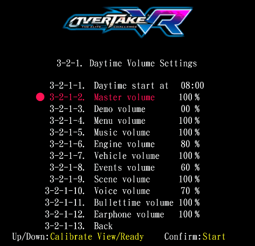
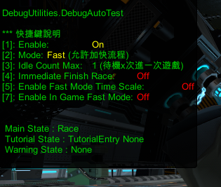
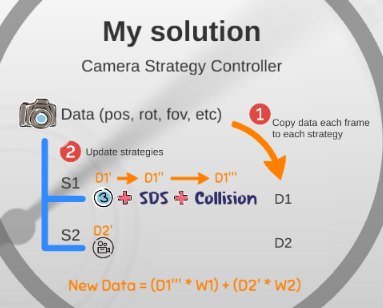

## 工作內容

> ### 狂野飆車 9 DX
>
> - 【後台】
>   - 資料庫
>   - Server
>     - 玩家資料、遊戲 Log、營收、活動、排行榜
>   - 玩家帳號登入 Server
>     - 機台 QR -> Server -> 導向第三方登入授權 -> oauth 取得 access token -> 取得資料 -> 登入
>   - 機台校時 Server
> - 【遊戲元件】
>   - Rank Manager
>     - 上傳玩家成績
>     - 同步全球、區網排行榜
>   - Revenue Manager
>   - Player Log Recorder
>   - GIF Recorder
>     - Webcam 拍攝玩家頭像
>     - 導入臉部追蹤
>     - 儲存拍攝畫面並製作成 GIF
>     - 將 GIF 同步至對戰玩家
>   - Webcam Streaming
>     - 影像同步至對戰玩家
>   - Progress Observer
>     - 同步對戰玩家遊戲流程進度
> - 【決策】
>   - 測試 LINE Bot
>     - 向 Server 取得當前玩家人數、營收等資訊
>     - </img>
> - 【工具】
>   - 構想出新方式並教導音樂音效小組製作更逼真車輛音效
>   - [A9CT](#個人作品)
>   - [BSelection](#個人作品)
>   - [BAttach](#個人作品)

> ### 狂野飆車 9 VR
>
> - 【後台】
>   - 資料庫
>   - Server 移植
>   - 玩家帳號登入 Server 移植
>   - 機台校時 Server 移植
> - 【遊戲元件】
>   - Rank Manager 移植
>   - Revenue Manager 移植

> ### 極速雪摩
>
> - 【後台】
>   - 資料庫
>   - Server 移植
>   - 機台校時 Server 移植
> - 【遊戲元件】
>   - Rank Manager 移植
>   - Revenue Manager 移植
> - 【工具】
>   - [Progress Bar](#個人作品)

> ### 勝利摩托 VR
>
> - 【遊戲元件】
>   - Distance Manager
>     - KD-Tree Algorithm
>     - 管理與計算車輛里程數
>   - Event System
>     - Pub/Sub Pattern
>   - [Race Match Net](#個人作品)
>     - 大廳制對戰配對系統
> - 【工具】
>   - [BMidLine](#個人作品)

> ### 火線狂飆 VR
>
> - 【遊戲元件】
>   - AI Controller
>     - 名次戰術
>     - 閃避障礙物
>     - 過彎、甩尾
>   - Audio Manager
>     - 機台日夜音量變更
>     - </img>
>     - 音量平衡動態切換
>     - 真實車輛引擎聲
>     - 車輛甩尾 Pitch 變化
>   - Auto Tester
>     - 自動化測試產品穩定度
>     - </img>
>   - Sequence Update Manager
>     - 依場景物件階層，固定更新順序
> - 【美術】
>   - 串接運鏡動畫
>   - 優化車輛音效效果: 拉轉、燒胎等
> - 【決策】
>   - 評估與介紹 Unreal 4
>   - 評估與介紹 Wwise
>   - 實驗 Unity3D 中使用確定性同步物理，以降低網路傳輸量
>   - 實驗粒子合成引擎聲
> - 【工具】
>   - [Delete Missing Scripts](#個人作品)
>   - [BInspector](#個人作品)
>   - Find Objects Of Type All In Scene

> ### 極速摩托 3
>
> - 【決策】
>   - 評估 Unity 4.x vs Unity 5.x
>     - LOD 效能優化
>     - 布料、髮絲物理
> - 【遊戲元件】
>   - Distance Manager
>     - KD-Tree Algorithm
>     - 管理與計算車輛里程數
>   - Vehicle Manager
>     - 管理比賽車輛
>   - Event System
>     - Pub/Sub Pattern
>   - 攝影機運鏡
>     - 過場與遊戲攝影機銜接
>     - 狀態優先度與疊加設計
>     - </img>
>     - Replay Cam 切換
>   - Audio Manager
>     - 機台日夜音量變更
>     - 音量平衡動態切換
>     - 真實車輛引擎聲
>     - 車輛甩尾 Pitch 變化
>   - IO Handler
>     - 管理框體 IO 訊號
> - 【工具】
>   - [B-Midline](#個人作品)
>   - [B-Sound-Editor](#個人作品)
>   - [Unity Debugger](#個人作品)
>   - [Unity Log Helper](#個人作品)

> ### 勝利追擊
>
> - 【優化】
>   - CPU 效能優化
> - 【美術】
>   - 引擎蓋視角嘗試
>   - 粒子特效控制
>   - 攝影機手持運鏡效果

> ### 毛毛童萌會
>
> - 【遊戲元件】
>   - AI 邏輯開發
> - 【美術】
>   - 角色動畫綁定
>   - 角色配件切換
>   - 角色材質切換

> ### 潛艇聯萌
>
> - 【物理】
>   - 物件碰撞
> - 【遊戲元件】
>   - 無限拼接賽道
>   - 障礙物設計
>   - 敵人設計
>   - 子彈設計
>   - 操作員選單設計
>   - Event System
> - 【IO 控制】
>   - 框體方向盤控制
> - 【工具】
>   - Trigger 編輯器
>   - 框體燈光編輯器
