# 作品集

[[English Version]](./README_EN.md)

## 目錄

- [公司產品](#公司產品)
- [個人作品](#個人作品)
- [其他](#其他)
- [作品預覽](#作品預覽)

## 公司產品

    <a href="https://youtu.be/4_J2BJvY6-o" target="_blank">
        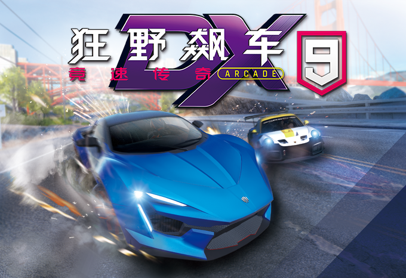
    </a>
    <a href="https://youtu.be/0NxRoB6_TiM" target="_blank">
        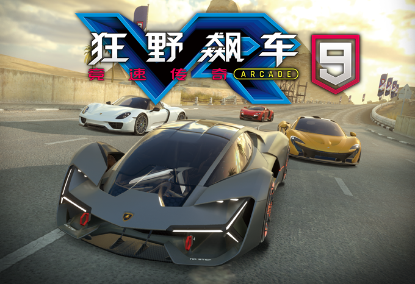
    </a>
    <a href="https://youtu.be/5gkZJXwEj4c" target="_blank">
        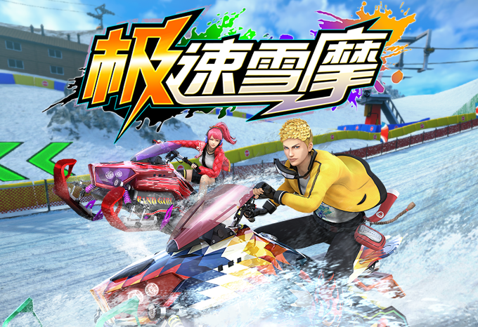
    </a>
     
    
    
    <a href="https://youtu.be/AB4iQr1gpoc" target="_blank">
        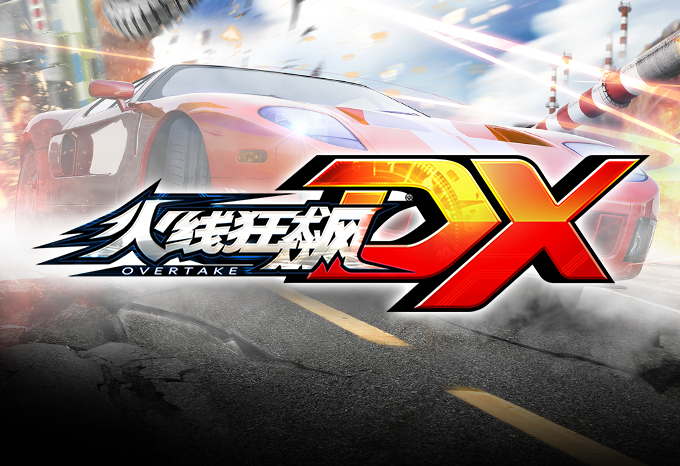
    </a>
     
    <a href="https://youtu.be/x51WJhPdX5E" target="_blank">
        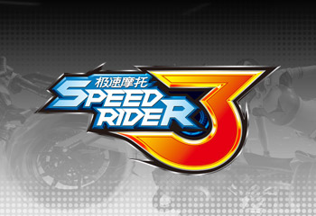
    </a>
    
    

[[工作內容]](./JobDescription.md)

## 個人作品

> 以下為過去所開發的工具清單，提升團隊開發效率、協助夥伴。

| No. | Name                                              | Difficulty | Popularity | Description                                                                                                                                                 |
| --- | ------------------------------------------------- | ---------- | ---------- | ----------------------------------------------------------------------------------------------------------------------------------------------------------- |
| 1   | [A9CT](#a9ct)                                     | `★★★★`     | `★★★`      | 遊戲修改器: 讓團隊成員能透過修改器自由控制他款遊戲視角，以參考其美術做法                                                                                    |
| 2   | Any-Struct                                        | `★★`       | `★★★`      | 嘗試製作 struct 基底類，解決 C# 轉型 Boxing [[GitHub]](https://github.com/snoopyuj/AnyStruct)                                                               |
| 3   | [B-Attach](#b-attach)                             | `★★`       | `★★★`      | Unity 小工具: 輕鬆控制物件貼地                                                                                                                              |
| 4   | [B-Inspector](#b-inspector)                       | `★★★`      | `★★★★`     | Unity 介面優化: 讓 Inspector 更加人性化 [[GitHub]](https://github.com/snoopyuj/BInspector)                                                                  |
| 5   | [B-Midline](#b-midline)                           | `★★★★★`    | `★★★★`     | Unity 工具: 提高繪製賽道中線效率                                                                                                                            |
| 6   | [B-Selection](#b-selection)                       | `★★`       | `★★★★★`    | Unity 小工具: 記憶多選的場景物件，以利下次選取 [[GitHub]](https://github.com/snoopyuj/BSelection)                                                           |
| 7   | [B-Shortcut](#b-shortcut)                         | `★★`       | `★★★★★`    | Unity 小工具: 記憶選取的專案資源或資料夾，以利下次選取 [[GitHub]](https://github.com/snoopyuj/BShortcut)                                                    |
| 8   | [B-Sound-Editor](#b-sound-editor)                 | `★★★★`     | `★★★★★`    | Unity 工具: 於編輯面板上修改並預覽場景音效                                                                                                                  |
| 9   | [B-Sound-Mute](#b-sound-mute)                     | `★★★★`     | `★★★★★`    | Windows 系統工具，快速切換軟體靜音 [[GitHub]](https://github.com/snoopyuj/bSoundMute) [[巴哈文章]](https://forum.gamer.com.tw/Co.php?bsn=60030&sn=1868316)  |
| 10  | [BEPU-Unity](#bepu-unity)                         | `★★★★★`    | `★★`       | 實驗將定點運算 (Fixed Point Math) 的物理系統 BEPU 導入 Unity，嘗試確定性同步 (Deterministic Synchronization) 的可能性                                       |
| 11  | [Delete-Missing-Scripts](#delete-missing-scripts) | `★★`       | `★★★★`     | Unity 小工具: 找尋物件中已遺失的腳本並刪除                                                                                                                  |
| 12  | [Dot-Netty-Server](#dot-netty-server)             | `★★★★★`    | `★★★★★`    | 利用 [DotNetty](https://github.com/Azure/DotNetty) 與 [MessagePack](https://github.com/neuecc/MessagePack-CSharp) 所做成的 C# Server 框架，效能、移植性兼具 |
| 13  | [Full-Screen-Game-View](#full-screen-game-view)   | `★★★`      | `★★`       | Unity 小工具: 能將 Game View 最大化顯示並隱藏工具列 [[GitHub]](https://gist.github.com/snoopyuj/92e0b62ca687aeb5d5c76af573c32370)                           |
| 14  | Net-Kit-Win7                                      | `★★`       | `★★★★★`    | Windows 系統工具: 快速切換網路介面卡靜態、動態 IP                                                                                                           |
| 15  | [Odin-Array-Enum-Title](#odin-array-enum-title)   | `★★★`      | `★★★★★`    | 根據 Enum 命名陣列中的元素標題 [[GitHub]](https://github.com/snoopyuj/OdinEnumArrayTitle)                                                                   |
| 16  | [Progress-Bar](#progress-bar)                     | `★★`       | `★★★★★`    | Windows 工具: 於畫面上顯示進度條與設定的文字內容                                                                                                            |
| 17  | [Race-Match-Net](#race-match-net)                 | `★★★★★`    | `★★★★★`    | 可移植的大廳制對戰配對系統                                                                                                                                  |
| 18  | [Trash-View](#trash-view)                         | `★★★`      | `★★★★★`    | Windows 工具: 透過網路將複製的內容同步至其他電腦的剪貼簿中，方便快速複製貼上                                                                                |
| 19  | [Unity-Debugger](#unity-debugger)                 | `★★★`      | `★★★★★`    | Unity 工具: 使開發人員可依據鍵盤功能鍵切換不同 Debug 功能                                                                                                   |
| 20  | [Unity-Log-Helper](#unity-log-helper)             | `★★`       | `★★★★★`    | Unity 工具: 依標籤的不同，決定是否印出對應的 Log，使開發人員能專注在自己想注意的 Log 上                                                                     |

## 其他

| No. | Name                                                            | Description                                                                                                          |
| --- | --------------------------------------------------------------- | -------------------------------------------------------------------------------------------------------------------- |
| 1   | [GTA4-Jason-Statham](#gta4-jason-statham)                       | 製作 GTA4 MOD: 將主角臉型模仿傑森史塔森的模樣 [[MOD 連結]](https://www.gtagaming.com/jason-statham-face-f25156.html) |
| 2   | [The-Witcher-3-White-Wolf](#the-witcher-3-white-wolf)           | 製作巫師三 MOD: 依據小說描述，調整主角模型貼圖 [[MOD 連結]](https://www.nexusmods.com/witcher3/mods/2122)            |
| 3   | [The-Witcher-3-Short-Scar-Ciri](#the-witcher-3-short-scar-ciri) | 製作巫師三 MOD: 美化女主角臉上疤痕 [[MOD 連結]](https://www.nexusmods.com/witcher3/mods/2036)                        |

## 作品預覽

### A9CT

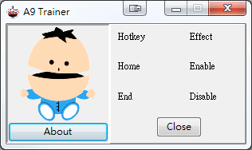</img>

### B-Attach

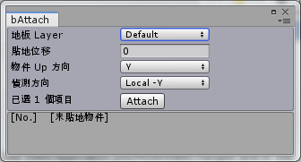</img>

### B-Inspector

### B-Midline

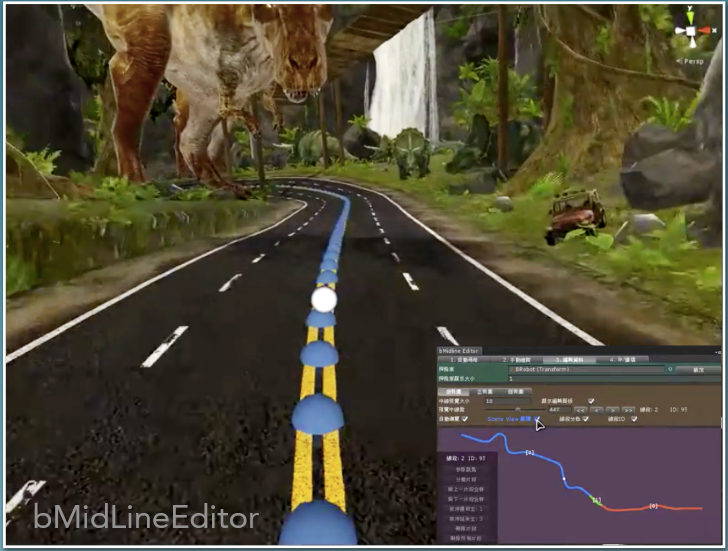</img>

### B-Selection

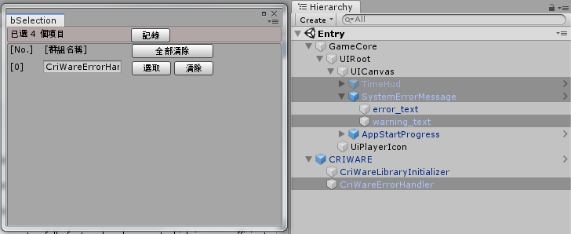</img>
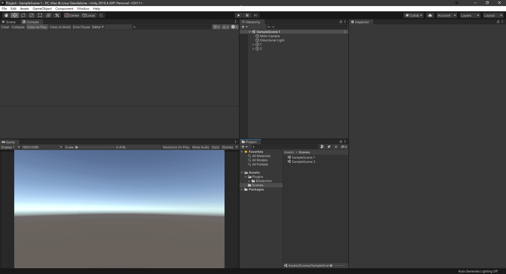

### B-Shortcut

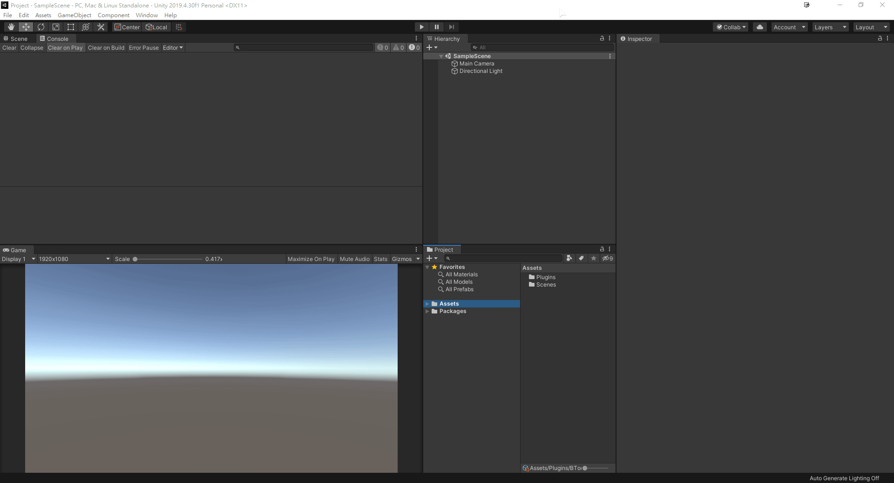

### B-Sound-Editor

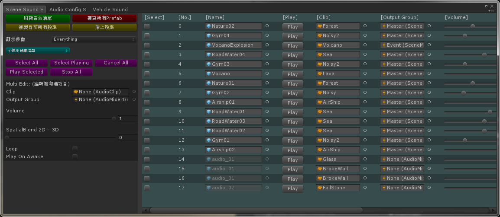</img>

### B-Sound-Mute

</img>

### Dot-Netty-Server

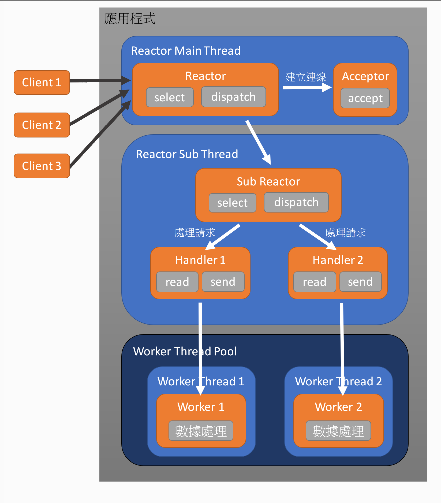</img>

### BEPU-Unity

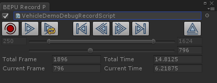</img>

### Delete-Missing-Scripts

### Full-Screen-Game-View

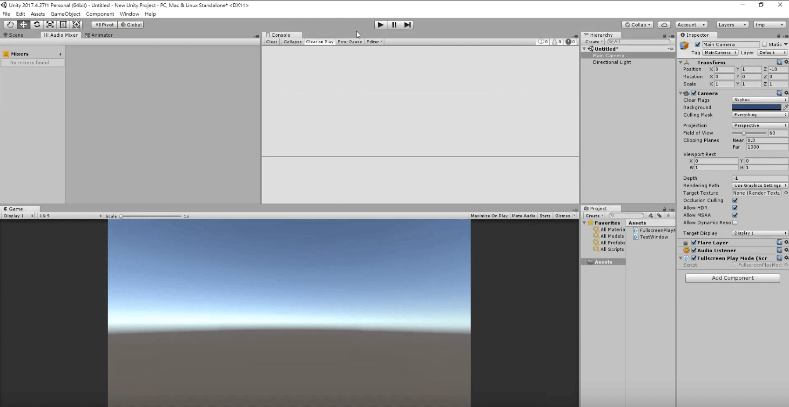

### Odin-Array-Enum-Title

### Progress-Bar

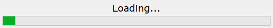</img>

### Race-Match-Net

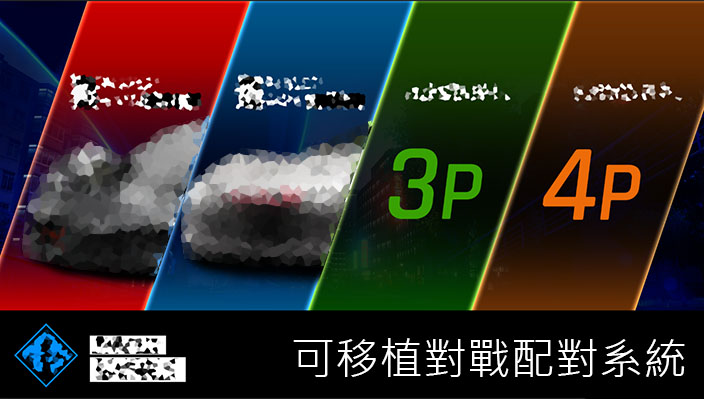</img>
 
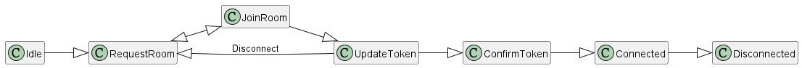</img>

### Trash-View

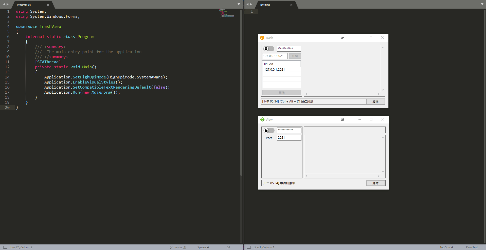

### Unity-Debugger

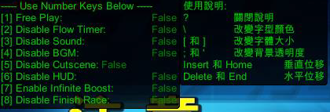</img>

### Unity-Log-Helper

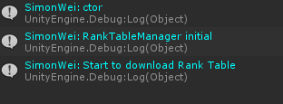</img>

### GTA4-Jason-Statham

</img>

### The-Witcher-3-White-Wolf

</img>

### The-Witcher-3-Short-Scar-Ciri

</img>
