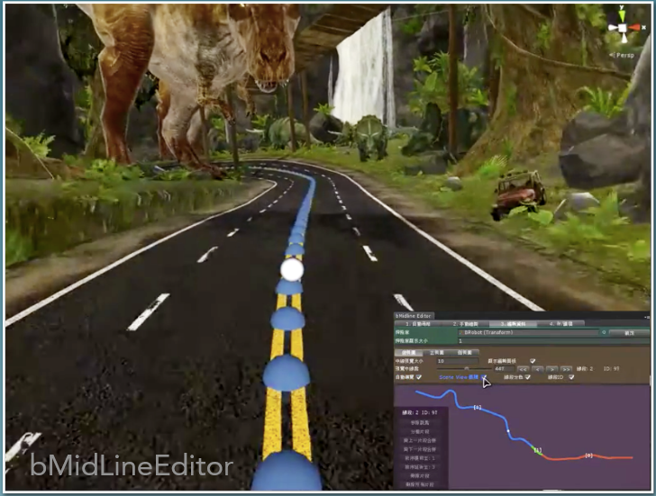
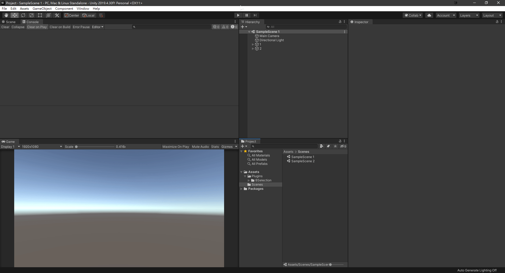
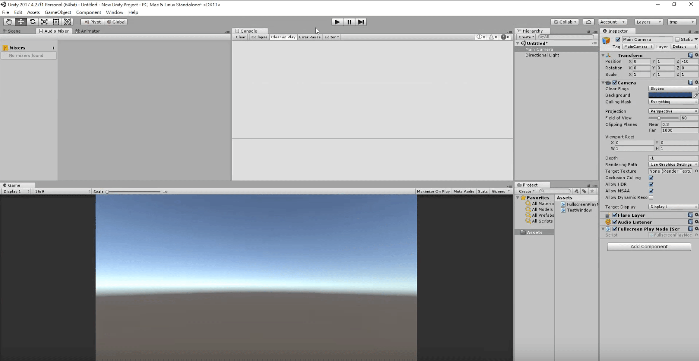
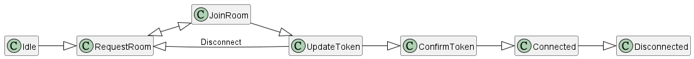
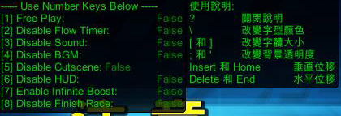
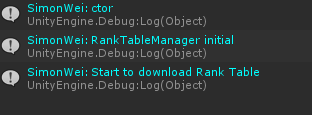

# Portfolio

[[Chinese Version]](./README.md)

## Table of Contents

- [Products](#products)
- [Tools](#tools-list)
- [Others](#others)
- [Previews](#previews)

## Products

 

 

> ### ASPHALT 9: LEGENDS ARCADE DX
>
> - 【Backend】
>   - Database
>   - Game Server
>     - Player Data, Game Log, Revenue, Activities, Rankings
>   - Login Server
>     - Machine QR Code -> Server -> Third-party Login Authorization -> Get access token by oauth -> Acquire Data -> Login
>   - Time Correction Server
> - 【Game Components】
>   - Rank Manager
>     - Upload player scores
>     - Synchronize global and local rankings
>   - Revenue Manager
>   - Player Log Recorder
>   - GIF Recorder
>     - Capture player using Webcam
>     - Import face recognition system
>     - Save pictures and create GIF
>     - Synchronize GIF to opponents
>   - Webcam Streaming
>     - Synchronize to opponents
>   - Progress Observer
>     - Synchronize opponents' game progress
> - 【Decisions】
>   - Evaluate the possibility of using LINE Bot
>     - Obtain current number of players, revenue, etc
>     - </img>
> - 【Tools】
>   - Create a new ways and teach the audio engineers to make realistic vehicle sounds more easier
>   - [A9CT](#tools-list)
>   - [BSelection](#tools-list)
>   - [BAttach](#tools-list)

> ### ASPHALT 9: LEGENDS ARCADE VR
>
> - 【Backend】
>   - Database
>   - Game Server Migration
>   - Login Server Migration
>   - Time Correction Server Migration
> - 【Game Components】
>   - Rank Manager Migration
>   - Revenue Manager Migration

> ### HYPER CROSS
>
> - 【Backend】
>   - Database
>   - Game Server Migration
>   - Time Correction Server Migration
> - 【Game Components】
>   - Rank Manager Migration
>   - Revenue Manager Migration
> - 【Tools】
>   - [Progress Bar](#tools-list)

> ### ULTRA MOTO VR
>
> - 【Game Components】
>   - Distance Manager
>     - KD-Tree Algorithm
>     - Manage and calculate vehicle mileage
>   - Event System
>     - Pub/Sub Pattern
>   - [Race Match Net](#tools-list)
>     - Portable lobby-based matching system
> - 【Tools】
>   - [BMidLine](#tools-list)

> ### OVERTAKE VR
>
> - 【Game Components】
>   - AI Controller
>     - Ranking Strategies
>     - Obstacle Dodging
>     - Turning, Drift
>   - Audio Manager
>     - Change machine volume day and night
>     - </img>
>     - Dynamically switch volume balance
>     - Real Vehicle Engine Sound
>     - Dynamic Drift Pitch
>   - Auto Tester
>     - Automated test product stability
>     - </img>
>   - Sequence Update Manager
>     - Fixed update sequence based on scene object hierarchy
> - 【Visual Effects】
>   - Connect camera animations
>   - Enhance vehicle sound effects
> - 【Decisions】
>   - Introduce Unreal 4
>   - Introduce Wwise
>   - Import BEPU into Unity (experimental)
>   - Particle Synthesis Vehicle Engine Sound (experimental)
> - 【Tools】
>   - [Delete Missing Scripts](#tools-list)
>   - [BInspector](#tools-list)
>   - Find Objects Of Type All In Scene

> ### Speed Rider 3
>
> - 【Decisions】
>   - Unity 4.x vs Unity 5.x
>     - LOD Performance Optimization
>     - Cloth, Hair Physics
> - 【Game Components】
>   - Distance Manager
>     - KD-Tree Algorithm
>     - Manage and calculate vehicle mileage
>   - Vehicle Manager
>     - Manage racing vehicles
>   - Event System
>     - Pub/Sub Pattern
>   - Camera Control
>     - Connection between cutscene and game view
>     - State priority and overlay design
>     - </img>
>     - Replay Cam Switch
>   - Audio Manager
>     - Change machine volume day and night
>     - Dynamically switch volume balance
>     - Real Vehicle Engine Sound
>     - Dynamic Drift Pitch
>   - IO Handler
>     - Manage Machine IO Signals
> - 【Tools】
>   - [B-Midline](#tools-list)
>   - [B-Sound-Editor](#tools-list)
>   - [Unity Debugger](#tools-list)
>   - [Unity Log Helper](#tools-list)

> ### Fluffy Rider - Water Park
>
> - 【Game Components】
>   - AI Logic
> - 【Visual Effects】
>   - Character Animations
>   - Character Accessory Controller
>   - Character Material Controller

> ### Captain Sub
>
> - 【Physics】
>   - Obstacle and Bullet Collision
> - 【Game Components】
>   - Infinite Track
>   - Obstacle Design
>   - Enemy Design
>   - Bullet Design
>   - Operator Setting
>   - Event System
> - 【IO】
>   - Wheel Control
> - 【Tools】
>   - Trigger Editor
>   - Light Pattern Editor

## Tools List

> The following is a list of tools I developed. Almost all of them are focus on improving team development efficiency and helping peers.

| No. | Name                                              | Difficulty | Popularity | Description                                                                                                                                                                                                                                          |
| --- | ------------------------------------------------- | ---------- | ---------- | ---------------------------------------------------------------------------------------------------------------------------------------------------------------------------------------------------------------------------------------------------- |
| 1   | [A9CT](#a9ct)                                     | `★★★★`     | `★★★`      | Cheat Engine: Allow our team members to freely control the camera in other games, thus we can learn how they create those scenes                                                                                                                     |
| 2   | Any-Struct                                        | `★★`       | `★★★`      | An alternative solution to solve the problem of the boxing in C# [[Article]](https://bwaynesu.wordpress.com/2021/08/21/%e5%98%97%e8%a9%a6%e8%a3%bd%e4%bd%9c-struct-%e5%9f%ba%e5%ba%95%e9%a1%9e%ef%bc%8c%e8%a7%a3%e6%b1%ba%e8%bd%89%e5%9e%8b-boxing/) |
| 3   | [B-Attach](#b-attach)                             | `★★`       | `★★★`      | Unity Tool: Attach the game objects to the ground easily                                                                                                                                                                                             |
| 4   | [B-Inspector](#b-inspector)                       | `★★★`      | `★★★★`     | Unity Interface Enhance: Make Unity's Inspector more friendly                                                                                                                                                                                        |
| 5   | [B-Midline](#b-midline)                           | `★★★★★`    | `★★★★`     | Unity Tool: Improve the efficiency of drawing the midline of the track                                                                                                                                                                               |
| 6   | [B-Selection](#b-selection)                       | `★★`       | `★★★★★`    | Unity Tool: Cache the data of the selected game objects from the scene to re-select them next time quickly                                                                                                                                           |
| 7   | [B-Shortcut](#b-shortcut)                         | `★★`       | `★★★★★`    | Unity Tool: Cache the data of the selected files/folder from the project to re-select them next time quickly                                                                                                                                         |
| 8   | [B-Sound-Editor](#b-sound-editor)                 | `★★★★`     | `★★★★★`    | Unity Tool: Easy to balance the sound effects of the scene                                                                                                                                                                                           |
| 9   | [B-Sound-Mute](#b-sound-mute)                     | `★★★★`     | `★★★★★`    | Windows System Tool: Mute the programs easily [[Article]](https://forum.gamer.com.tw/Co.php?bsn=60030&sn=1868316)                                                                                                                                    |
| 10  | [BEPU-Unity](#bepu-unity)                         | `★★★★★`    | `★★`       | Try to import the fixed point math version of BEPU (Physics Engine) into Unity                                                                                                                                                                       |
| 11  | [Delete-Missing-Scripts](#delete-missing-scripts) | `★★`       | `★★★★`     | Unity Tool: Find and delete the missing scripts in all objects                                                                                                                                                                                       |
| 12  | [Dot-Netty-Server](#dot-netty-server)             | `★★★★★`    | `★★★★★`    | A framework of C# sever made with [DotNetty](https://github.com/Azure/DotNetty) and [MessagePack](https://github.com/neuecc/MessagePack-CSharp)                                                                                                      |
| 13  | [Full-Screen-Game-View](#full-screen-game-view)   | `★★★`      | `★★`       | Unity Tool: Maximize the game view and hide the toolbar on the top                                                                                                                                                                                   |
| 14  | Net-Kit-Win7                                      | `★★`       | `★★★★★`    | Windows System Tool: Switch between static IP and dynamic IP easily                                                                                                                                                                                  |
| 15  | [Progress-Bar](#progress-bar)                     | `★★`       | `★★★★★`    | Windows Tool: Display the progress bar and the text on the screen                                                                                                                                                                                    |
| 16  | [Race-Match-Net](#race-match-net)                 | `★★★★★`    | `★★★★★`    | Portable lobby-based matching system                                                                                                                                                                                                                 |
| 17  | [Trash-View](#trash-view)                         | `★★★`      | `★★★★★`    | Windows Tool: Synchronize the data in the clipboard easily through local net                                                                                                                                                                         |
| 18  | [Unity-Debugger](#unity-debugger)                 | `★★★`      | `★★★★★`    | Unity Tool: Allow developers to switch between different debug functions according different hot-keys                                                                                                                                                |
| 19  | [Unity-Log-Helper](#unity-log-helper)             | `★★`       | `★★★★★`    | Unity Tool: Categorize the log by different tags and print the selected log                                                                                                                                                                          |

## Others

| No. | Name                                                            | Description                                                                                                                                                                            |
| --- | --------------------------------------------------------------- | -------------------------------------------------------------------------------------------------------------------------------------------------------------------------------------- |
| 1   | [GTA4-Jason-Statham](#gta4-jason-statham)                       | GTA4 MOD: Edit the model of the main character to make him more like Jason Statham [[MOD Link]](https://www.gtagaming.com/jason-statham-face-f25156.html)                              |
| 2   | [The-Witcher-3-White-Wolf](#the-witcher-3-white-wolf)           | The Witcher 3 MOD: According to the description in the novel, edit the texture of Geralt to make him look more cold-blooded [[MOD Link]](https://www.nexusmods.com/witcher3/mods/2122) |
| 3   | [The-Witcher-3-Short-Scar-Ciri](#the-witcher-3-short-scar-ciri) | The Witcher 3 MOD: Beautify the scar on Ciri's face [[MOD Link]](https://www.nexusmods.com/witcher3/mods/2036)                                                                         |

## Previews

### A9CT

</img>

### B-Attach

</img>

### B-Inspector

### B-Midline

</img>

### B-Selection

</img>

### B-Shortcut

### B-Sound-Editor

</img>

### B-Sound-Mute

</img>

### Dot-Netty-Server

</img>

### BEPU-Unity

</img>

### Delete-Missing-Scripts

### Full-Screen-Game-View

### Progress-Bar

</img>

### Race-Match-Net

</img>
 
</img>

### Trash-View

### Unity-Debugger

</img>

### Unity-Log-Helper

</img>

### GTA4-Jason-Statham

</img>

### The-Witcher-3-White-Wolf

</img>

### The-Witcher-3-Short-Scar-Ciri

</img>
