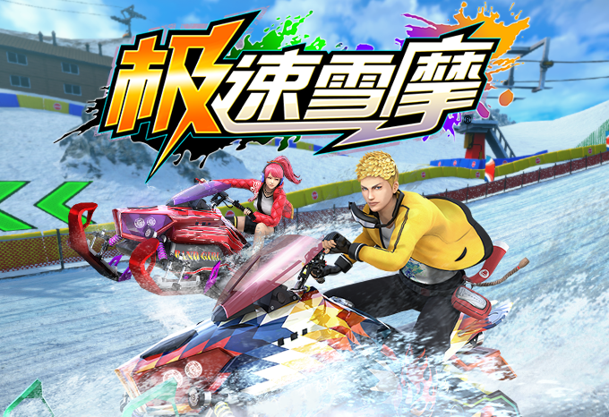
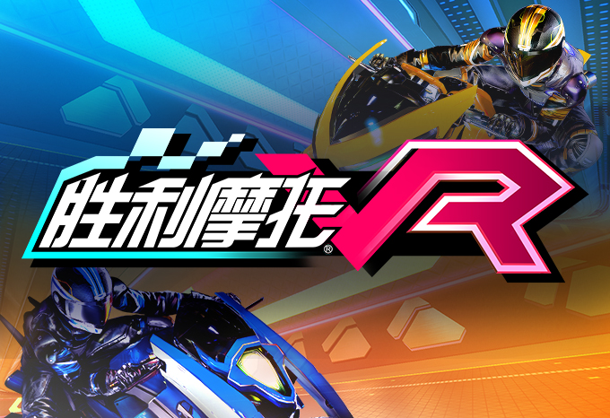
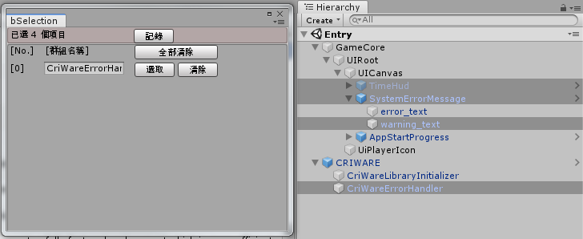
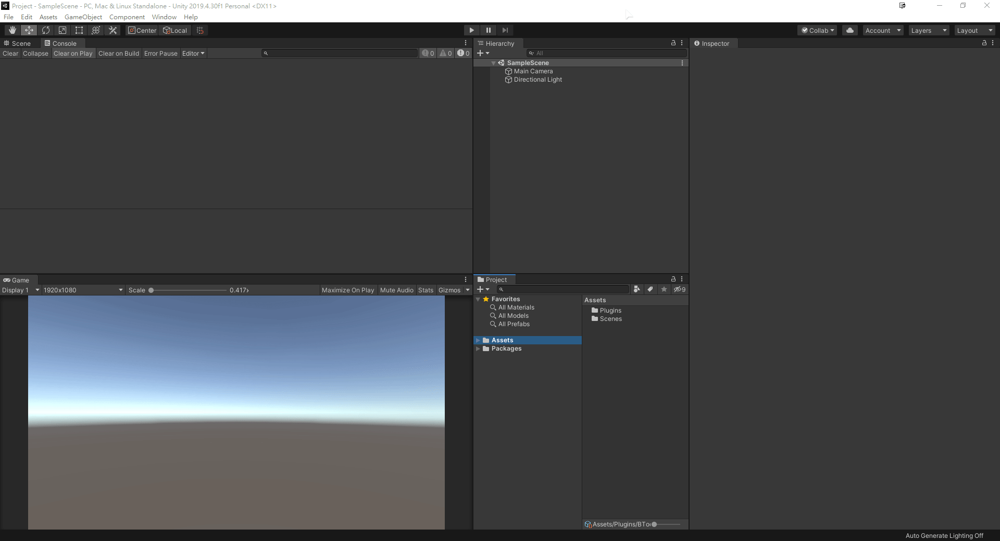
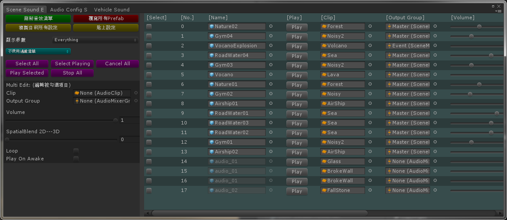
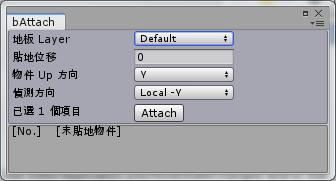
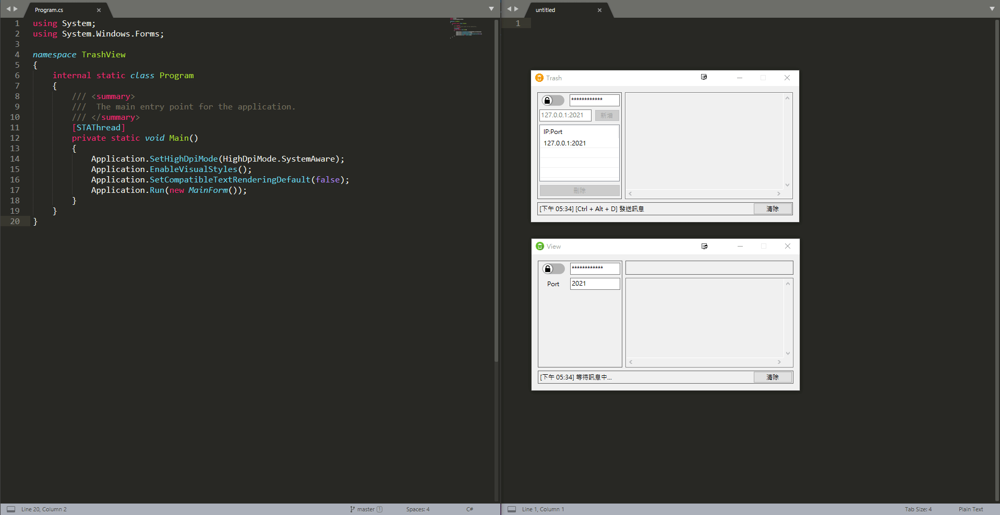

# Portfolio

[[中文版]](./README.md)

## Table of Contents

- [Products](#products)
- [Tools](#tools-list)
- [Others](#others)
- [Previews](#previews)

## Products

    
    
    
     
    
    
    
     
    
    
    

### Main Contributions

| No. | Description                                                                                                                                             |
| --- | ------------------------------------------------------------------------------------------------------------------------------------------------------- |
| 1   | Independently developed the game prototype with minimal manpower to validate the core gameplay                                                          |
| 2   | Designed the transition and integration between the cutscenes and game camera, and implemented state priority and overlay features (like Cinemachine)   |
| 3   | Implemented the KD Tree algorithm to significantly improve object search performance on the track (O(logN) Time)                                        |
| 4   | Developed an automatic verification mechanism to reduce manpower costs during game stability testing                                                    |
| 5   | Developed a sound effects editing interface to improve the development process                                                                          |
| 6   | Improved the performance of vehicle AI from 1.5 ms to 0.05 ms                                                                                           |
| 7   | Implemented a portable lobby-based matchmaking system                                                                                                   |
| 8   | Implemented a highly stable and efficient game server using the [DotNetty](https://github.com/Azure/DotNetty) framework and ported it to three projects |
| 9   | Devised a strategy to reduce the leaderboard request count by 75% for the Game Server                                                                   |

## Tools List

> Here is a list of tools I have developed to improve team development efficiency and assist my colleagues.

| No. | Name                                              | Description                                                                                                                                                            |
| --- | ------------------------------------------------- | ---------------------------------------------------------------------------------------------------------------------------------------------------------------------- |
| 1   | AnyStruct                                         | ★ An alternative solution to solve the problem of the boxing in C# [[GitHub]](https://github.com/snoopyuj/AnyStruct)                                                   |
| 2   | [BInspector](#binspector)                         | ★ Unity Interface Enhance: Make Unity's Inspector more friendly [[GitHub]](https://github.com/snoopyuj/BInspector)                                                     |
| 3   | [BSelection](#bselection)                         | ★ Unity Tool: Cache the data of the selected game objects from the scene to re-select them next time quickly [[GitHub]](https://github.com/snoopyuj/BSelection)        |
| 4   | [BShortcut](#bshortcut)                           | ★ Unity Tool: Cache the data of the selected files/folder from the project to re-select them next time quickly [[GitHub]](https://github.com/snoopyuj/BShortcut)       |
| 5   | [BSoundMute](#bsoundmute)                         | ★ Windows System Tool: Mute the programs easily [[GitHub]](https://github.com/snoopyuj/bSoundMute) [[Article]](https://forum.gamer.com.tw/Co.php?bsn=60030&sn=1868316) |
| 6   | [BSoundEditor](#bsoundeditor)                     | ★ Unity Tool: Easy to balance the sound effects of the scene                                                                                                           |
| 7   | [Odin Array Enum Title](#odin-array-enum-title)   | ★ Unity Interface Enhance: Name the elements in the array according to the enum [[GitHub]](https://github.com/snoopyuj/OdinEnumArrayTitle)                             |
| 8   | [Full Screen Game View](#full-screen-game-view)   | Unity Tool: Maximize the game view and hide the toolbar on the top [[GitHub]](https://gist.github.com/snoopyuj/92e0b62ca687aeb5d5c76af573c32370)                       |
| 9   | [BMidline](#bmidline)                             | Unity Tool: Improve the efficiency of drawing the midline of the track                                                                                                 |
| 10  | [BEPU Unity](#bepu-unity)                         | Try to import the fixed point math version of BEPU (Physics Engine) into Unity                                                                                         |
| 11  | [Unity Debugger](#unity-debugger)                 | Unity Tool: Allow developers to switch between different debug functions according different hot-keys                                                                  |
| 12  | [Unity Log Helper](#unity-log-helper)             | Unity Tool: Categorize the log by different tags and print the selected log                                                                                            |
| 13  | [Delete Missing Scripts](#delete-missing-scripts) | Unity Tool: Find and delete the missing scripts in all objects                                                                                                         |
| 14  | [BAttach](#battach)                               | Unity Tool: Attach the game objects to the ground easily                                                                                                               |
| 15  | [Trash View](#trash-view)                         | Windows Tool: Synchronize the data in the clipboard easily through local net                                                                                           |

## Others

| No. | Name                                                            | Description                                                                                                                                                                            |
| --- | --------------------------------------------------------------- | -------------------------------------------------------------------------------------------------------------------------------------------------------------------------------------- |
| 1   | [Ringash](#ringash)                                             | Helped a friend develop an indie game [[Steam Link]](https://store.steampowered.com/app/2323140/Ringash/)                                                                              |
| 2   | [GTA4 Jason Statham](#gta4-jason-statham)                       | GTA4 MOD: Edit the model of the main character to make him more like Jason Statham [[MOD Link]](https://www.gtagaming.com/jason-statham-face-f25156.html)                              |
| 3   | [The Witcher 3 White Wolf](#the-witcher-3-white-wolf)           | The Witcher 3 MOD: According to the description in the novel, edit the texture of Geralt to make him look more cold-blooded [[MOD Link]](https://www.nexusmods.com/witcher3/mods/2122) |
| 4   | [The Witcher 3 Short Scar Ciri](#the-witcher-3-short-scar-ciri) | The Witcher 3 MOD: Beautify the scar on Ciri's face [[MOD Link]](https://www.nexusmods.com/witcher3/mods/2036)                                                                         |

## Previews

### BInspector

### BSelection

</img>

### BShortcut

### BSoundMute

</img>

### BSoundEditor

</img>

### Odin Array Enum Title

### Full Screen Game View

### BMidline

</img>

### BEPU Unity

</img>

### Unity Debugger

</img>

### Unity Log Helper

</img>

### Delete Missing Scripts

### BAttach

</img>

### Trash View

### Ringash

</img>

### GTA4 Jason Statham

</img>

### The Witcher 3 White Wolf

</img>

### The Witcher 3 Short Scar Ciri

</img>
